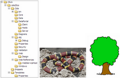
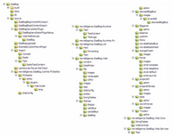
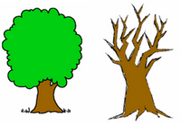
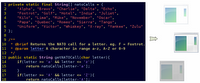
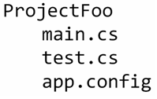
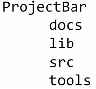

During [Desert Code Camp](http://www.desertcodecamp.com/), I put on a presentation called [Setting up .Net Development Trees](http://www.desertcodecamp.com/signUp.aspx?session=196) and promised to put up the notes from that presentation. So this is the first installment of that presentation:  
  
Trees  

  
Not too many people would think it important to have a discussion on Trees and may ask themselves, ‘This is about Trees?’ Well, yes. Trees as in the folders we use to create our projects. Our projects normally start out as one folder  

  

  
  

  

  
But then quickly turn into a mess of folders:  

  

  
  

  

  
So as we organize our folders we get a nice little tree of folders (Which looks more like a snake than a tree, but whatever).  

  

  
  

  

  
But as we know, trees can grow unruly and quickly get out of hand. For instance look at the tree structure for this dasBlog project.  

  

  
  

  

  
Wow! This is out of hand.  

  

  
  

  

  
Or is it? What makes a good tree different from a bad tree?  

  

  
  

  

  
One of the principles that I think can really make a good tree is the concept of S2C.  

  

  
S2C  

  

  
Do not confuse S2C with X2C which is a street term for the drug Ecstasy.  

  

  
  

  

  
S2C stands for Source to Compile and promotes the clear separation between the source code files that make a project from the end result files a project needs in order to run.  

  

  
  

  

  
Think of how .CS files are compiled down into .dlls but typically .aspx files stay the same when it comes time for deployment. There are also files that slightly change depending on the environment they are in. For instance the Same Web.config file will have different username and server name settings based upon whether it is in the development, qa, or production environments. S2C draws a clear separation between these source files and the end product, even if the files stay the same.  

  

  
1 Step Build  

  

  
Because I am a developer, I would rather spend my time actually writing code instead of spending time ensuring my config files are set up correctly for all the environments my project needs to target. In other words, I want to emphasize the ‘S’ and reduce the ‘2c’.  

  

  
  

  

  
The way to do that is to create a magic button that will automatically take my source code and in one single click produce the compiled code for every environment.  

  

  
  

  

  
Here is some good news! There are tools that will do that for us, the most popular being Ant, NAnt, and MSBuild. But before we start using these tools, we should get back to what this entire discussion is about, Trees.  

  

  
Development Trees  

  

  
There is nothing stopping me from creating a wonderful project name Foo with the following folder structure.  

  

  
  

  

  
Just as there is nothing wrong with this tree.  

  

  
  

  

  
A dead tree can still provide a home for small critters and bugs but we want to set up a tree that will help us use S2C. One of the most common folder structures in this one.  

  

  
  

  

  
This structure gives us the following folders for every project:  

  
- 
    docs – Docs is where you store every document you need to support this application. If your team uses a centralized document repository like Jira, or a Wiki, then use the common repository. What this will accomplish is everything that is needed for this project will be in a common folder. Like a small little suitcase with everything tucked away in its own little container.  
      
    
- 
    lib – Also known as ‘references’ or ‘assemblies’. Lib is where you will put the .dll files that your project needs in order to compile and work. If you are using NHibernate or Microsoft Application Blocks, then put the dll in lib and reference that specific version. If you do that, then you will ensure that your project’s version of NHibernate doesn’t change 6 months later when you start working on another project that uses the latest version of NHibernate. Again, this is all about sectioning off your project from the rest of the world.  
      
    
- 
    src – This is where you will find the project files. When I look at my src folder, I see exactly what I would have gotten if I didn’t use this method of folders. I see my main solution folder and all of my sub projects in their own folder.  
      
    
- 
    tools – The tools folder is where we will put things that will help us make the jump in S2C and 1 Click Build. This will house NAnt, NUnit, FXCop, and whatever other tool your team uses to help build quality software.  
      
    

  

  

  
In part II I will go over the example project of using these tools to help produce quality projects.
