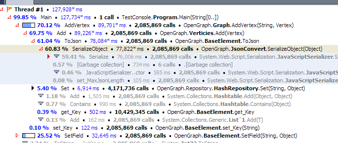

I've been working on parsing 1million records in to a local graph. I noticed that it was taking a while so I put together a test app to find where the problem could be. The tests was creating int.MaxValue number of vertices into the HashRepository.

# NVerticies Test

Running the test verified what I thought was happening. Somewhere the code is causing  "Quadratic Growth").

I ran a profiler on the code and found that 60% of the time was being spent on json serialization.

So I swapped out to a different [JSON serializer](http://json.codeplex.com/) an re-ran the test.

The first part of the graph could be  "Quadratic Growth") and the second looks linear  "Linear Growth"). The profiler showed an improvement. Now only 41% of the time is spent in serializing. But still it's not what I'm looking for. I want at least linear time.

Since it looks like it may be the serializer, I switch caused the serializer to just return a constant value each time.

Whala! There is the linear time I wanted. Notice the hops on the line when something took a little longer than usual. I would guess that is the hash table resizing. Let's see where the profiler says the code is spending its time. Now all the time is spent calculating the KeyHash for the property

Here are how they compare to each other

# NProperty Test

I still don't feel comfortable with the serializer as the culprit for the quadratic growth. Instead of creating a lot of Verticies, I will just create one vertex and add a lot of properties using the default serializer. This had a much better growth.

The profile tells me most of the time is in the Serializer. Hmmm. I have good growth and am using a serializer. Perhaps the serializer isn't the issue.

Let's see the Newtonsoft serializer.

Same growth, and most of the time was spent in the Serializer. Hmmm.

Let's see with no serializer.

Together they look like this

![](http://chart.apis.google.com/chart?chs=440x220&cht=lxy&chco=3072F3,FF0000,FF9900&chds=0,100,0,65,0,100,0,65,0,100,-5,65&chd=t:-1|0.2,0.6,1,1.3,1.7,2,2.4,2.7,3,3.4,3.8,4.2,4.6,5,5.5,5.8,6.1,6.6,7,7.3,7.7,8.2,8.6,9,9.4,9.7,10,10.4,10.8,11.2,11.6,11.9,12.2,12.7,13,13.4,13.8,14.1,14.5,14.8,15.2,15.6,16,16.4,16.8,17.2,17.5,17.9,18.2,18.6,19,19.4,19.9,20.3,20.7,21.1,21.5,21.9,22.4,22.7,23.1,23.4,23.9,24.3,24.6,25.1,25.6,26,26.3,26.7,27.1,27.4,27.8,28.1,28.4,28.8,29.1,29.5,29.8,30.1,30.5,30.8,31.2,31.6,31.9,32.2,32.6,33,33.5,33.8,34.2,34.6,34.9,35.3,35.7,36.1,36.5,36.8,37.2,37.5,37.8|-1|0.3,1,1.8,2.7,3.4,4.2,4.8,5.5,6.1,6.8,7.3,7.9,8.7,9.3,9.8,10.5,11.3,11.9,12.7,13.2,13.9,14.7,15.3,15.9,16.5,17.1,17.7,18.3,18.8,19.4,20,20.6,21.2,21.8,22.5,23.1,23.7,24.3,24.9,25.8,26.3,26.9,27.9,28.5,29.1,29.6,30.1,30.7,31.2,31.8,32.4,33.3,34,34.7,35.4,35.9,36.7,37.2,37.9,38.7,39.2,39.9,40.4,41,41.7,42.4,43,43.5,44.1,44.8,45.5,46.2,47.2,47.9,48.5,49,49.7,50.3,50.8,51.4,52,52.6,53.3,54.1,54.6,55.3,55.9,56.5,57,57.7,58.3,58.9,59.4,60,60.5,61.1,61.6,62.2,62.9,63.8,64.7|-1|2.6,2.9,3.2,3.4,3.6,3.8,4.1,4.3,4.4,4.6,4.8,4.9,5.1,5.2,5.4,5.5,5.7,5.9,6.1,6.3,6.5,6.7,6.8,7,7.2,7.3,7.5,7.7,7.9,8.1,8.2,8.4,8.7,8.8,9,9.1,9.6,9.7,10,10.2,10.3,10.5,10.7,10.9,11.1,11.3,11.5,11.6,11.8,12.1,12.3,12.5,12.7,12.8,13,13.1,13.3,13.4,13.5,13.7,14,14.2,14.3,14.5,14.6,14.7,14.9,15,15.1,15.2,15.4,15.5,15.7,15.8,16,16.1,16.3,16.5,16.6,16.8,17,17.2,17.3,17.5,17.7,17.9,18,18.2,18.3,18.5,18.6,18.7,18.9,19.1,19.2,19.5,19.6,19.8,19.9,20,20.2&chdl=No+Serializer|Default|Newton&chdlp=b&chls=2,4,1|1|1&chma=5,5,5,25 "NPropertyAll")

I'm not really seeing anything.
