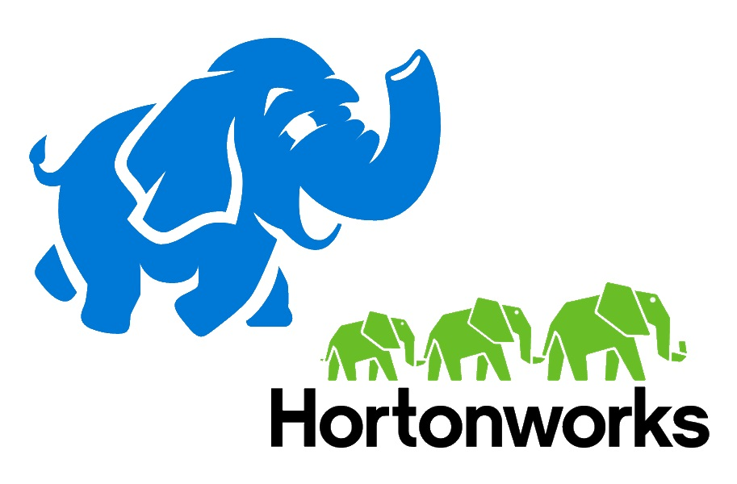

 

I get asked a lot about the differences between Microsoft HDInsight and Hortonworks HDP. Turns out there tight coordinated development efforts between the two companies. I was surprised to see how much closer the two products are now today compared to a year ago. Here is what I was able to find.

## Lag in Versions

As of today, 8 May 2017, the current versions are:

- HDP: 2.6
- HDInsight: 3.5. Based on HDP 2.5

So, the first thing we see is HDInsight has a lag between the latest and greatest of Hortonworks. This really results in differences between feature version. That makes sense because Azure is a different beast than a straight IaaS deployments. Microsoft engineers need to make it work with WASB storage and other Azure specific architecture (networking, security, etc).

## Feature Gaps

It would be great if all of the features were ported to Azure but they are not. Some priorities are made on what to support. I imagine this is driven by customer demand. Here are the feature not found in HDInsight:

- Druid
- Solr
- Slider
- Accumulo
- Falcon
- Atlas
- Flume
- Knox

## References

I found this information from the product pages

- HDP tools found in HDInsight [https://docs.microsoft.com/en-us/azure/hdinsight/hdinsight-component-versioning](https://docs.microsoft.com/en-us/azure/hdinsight/hdinsight-component-versioning)
- Apache tools found in HDP [https://hortonworks.com/products/data-center/hdp/](https://hortonworks.com/products/data-center/hdp/)
- [https://hortonworks.com/datasheet/microsoft-azure-hdinsight/](https://hortonworks.com/datasheet/microsoft-azure-hdinsight/)
