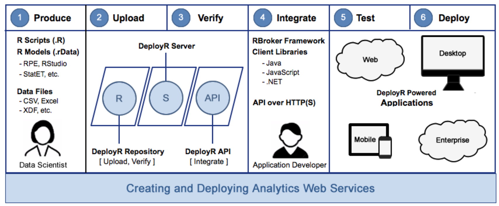
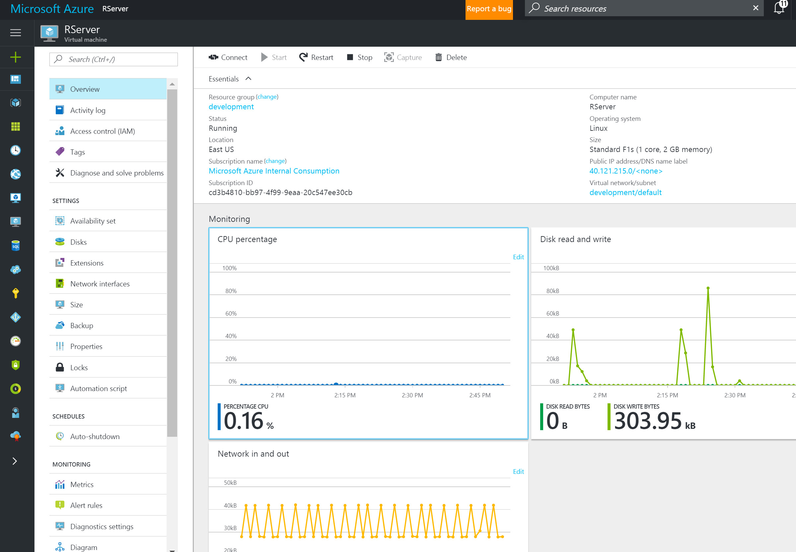
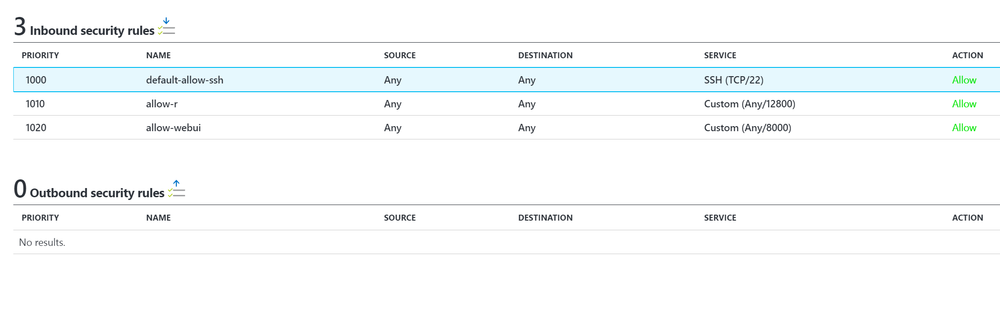
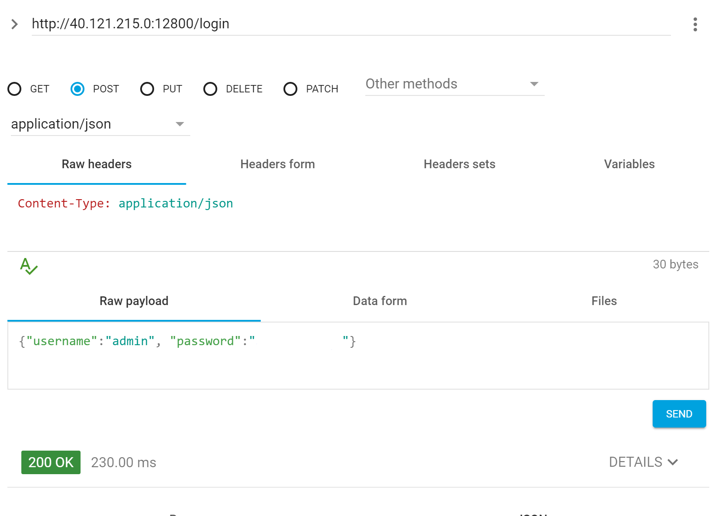
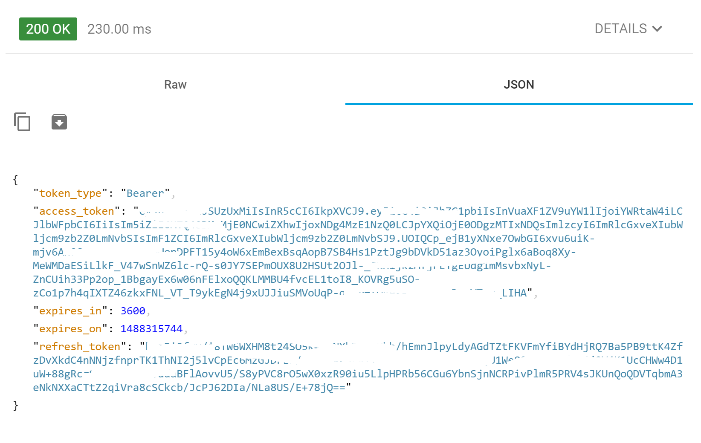
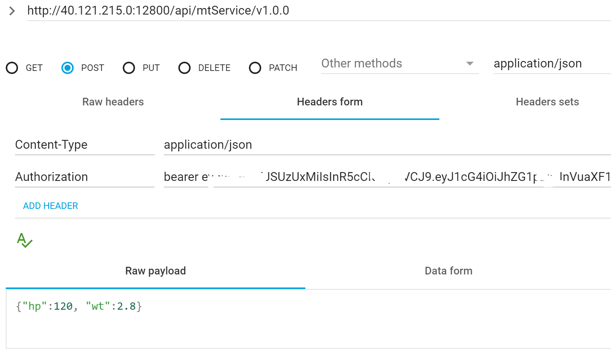
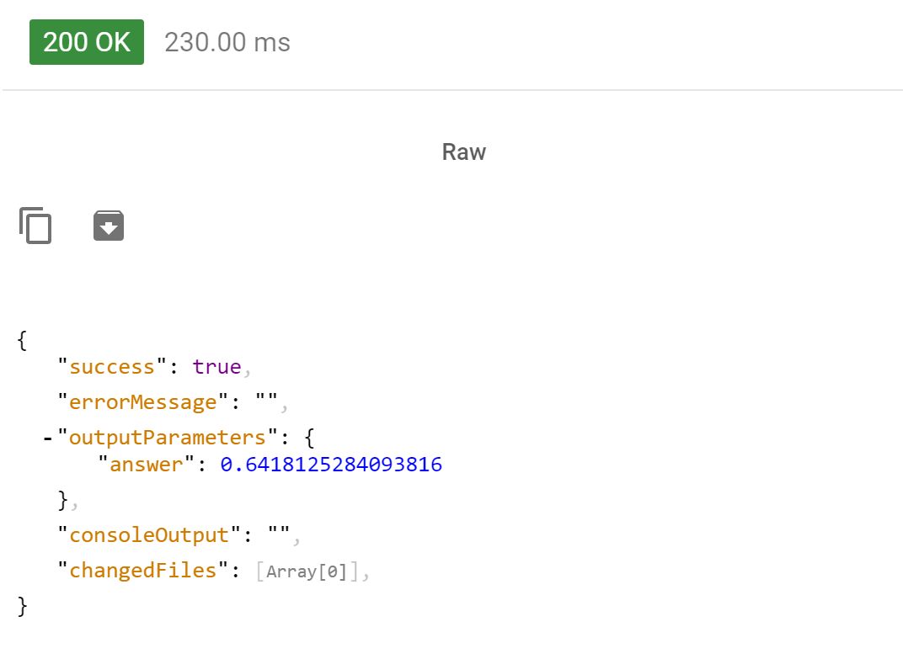

Many organizations are benefiting from advanced analytics and machine learning. I work with a lot of teams who create amazing data analytics models and who need to then deploy them in a way to be useful. This is what I've seen and one way to deploy models.

Generally deploying models run into two major obstacles technical and organizational. Any solution needs to cover both.

- Write your models and routines in your local environment.
- Deploy them as production-ready microservices.
- Update your models and routines and version the microservice.

The best teams version their models using version control software just as it's used in software development.

# Step by Step

**Stand up R Server in Azure**

- Navigate to Azure portal
- Spin up an R Server
- \[caption id="attachment\_1379" align="alignnone" width="2399"\] Azure R Server Dashboard\[/caption\]
- Open the network port
- 

**Configure Server**

- ssh onto the machine
- Launch Admin utility and configure password and server
- `
<code class="java plain">$ cd /usr/lib64/microsoft-deployr/</code><code class="java value">9.0</code><code class="java plain">.</code><code class="java value">1</code><code class="java plain">/</code>
 
<code class="java plain">$ sudo dotnet Microsoft.DeployR.Utils.AdminUtil/Microsoft.DeployR.Utils.AdminUtil.dll</code>\[/code\]

**Install RClient**

- Download R Client
- Configure RStudion to use R Client

**Create and Deploy Model**

- `## MODEL DEPLOYMENT EXAMPLE ##
    
    ########################################################## # Load mrsdeploy package on R Server # ##########################################################
    
    library(mrsdeploy)
    
    ########################################################## # Create & Test a Logistic Regression Model # ##########################################################
    
    \# Use logistic regression equation of vehicle transmission # in the data set mtcars to estimate the probability of # a vehicle being fitted with a manual transmission # based on horsepower (hp) and weight (wt)
    
    \# Create glm model with \`mtcars\` dataset carsModel <- glm(formula = am ~ hp + wt, data = mtcars, family = binomial)
    
    \# Produce a prediction function that can use the model manualTransmission <- function(hp, wt) { newdata <- data.frame(hp = hp, wt = wt) predict(carsModel, newdata, type = "response") }
    
    \# test function locally by printing results print(manualTransmission(120, 2.8)) # 0.6418125
    
    ########################################################## # Log into Microsoft R Server # ##########################################################
    
    \# Use \`remoteLogin\` to authenticate with R Server using # the local admin account. Use session = false so no # remote R session started remoteLogin("http://localhost:12800", username = “admin”, password = “{{YOUR\_PASSWORD}}”, session = FALSE)
    
    ########################################################## # Publish Model as a Service # ##########################################################
    
    \# Publish as service using \`publishService()\` function from # \`mrsdeploy\` package. Name service "mtService" and provide # unique version number. Assign service to the variable \`api\` api <- publishService( "mtService", code = manualTransmission, model = carsModel, inputs = list(hp = "numeric", wt = "numeric"), outputs = list(answer = "numeric"), v = "v1.0.0" )
    
    ########################################################## # Consume Service in R # ##########################################################
    
    \# Print capabilities that define the service holdings: service # name, version, descriptions, inputs, outputs, and the # name of the function to be consumed print(api$capabilities())
    
    \# Consume service by calling function, \`manualTransmission\` # contained in this service result <- api$manualTransmission(120, 2.8)
    
    \# Print response output named \`answer\` print(result$output("answer")) # 0.6418125
    
    ########################################################## # Get Service-specific Swagger File in R # ##########################################################
    
    \# During this authenticated session, download the # Swagger-based JSON file that defines this service swagger <- api$swagger() cat(swagger, file = "swagger.json", append = FALSE)
    
    \# Share Swagger-based JSON with those who need to consume it`
    

**Use Rest Api**

- Inspect swagger.json file
- Navigate to http://website:12800/api/mtService/v1.0.0/swagger.json

- Get authorization token with Rest Client
- 
- 
- Call Web service with token and parameters
- 
- 

# Resources

- About Deploy R [https://msdn.microsoft.com/microsoft-r/deployr-about](https://msdn.microsoft.com/microsoft-r/deployr-about)
- Configure R Server for Operationalize [https://msdn.microsoft.com/en-us/microsoft-r/operationalize/configuration-initial](https://msdn.microsoft.com/en-us/microsoft-r/operationalize/configuration-initial)
- Launch R Server Admin Utility [https://msdn.microsoft.com/en-us/microsoft-r/operationalize/admin-utility#launch](https://msdn.microsoft.com/en-us/microsoft-r/operationalize/admin-utility#launch)
- Getting started as Data Scientist [https://msdn.microsoft.com/en-us/microsoft-r/operationalize/data-scientist-get-started](https://msdn.microsoft.com/en-us/microsoft-r/operationalize/data-scientist-get-started)
- Microsoft R Overview [https://msdn.microsoft.com/en-us/microsoft-r/index](https://msdn.microsoft.com/en-us/microsoft-r/index)
- Getting Started with R [https://mran.microsoft.com/documents/getting-started/](https://mran.microsoft.com/documents/getting-started/)
- About RServer [https://msdn.microsoft.com/en-us/microsoft-r/deployr-about](https://msdn.microsoft.com/en-us/microsoft-r/deployr-about)
- RServer vs [https://www.reddit.com/r/rstats/comments/3n4dg0/deployr\_vs\_plumber/](https://www.reddit.com/r/rstats/comments/3n4dg0/deployr_vs_plumber/)
- Azure Functions [https://docs.microsoft.com/en-us/azure/azure-functions/functions-overview](https://docs.microsoft.com/en-us/azure/azure-functions/functions-overview)
- R Models via web services [http://blog.algorithmia.com/deploying-r-models-production-web-services/](http://blog.algorithmia.com/deploying-r-models-production-web-services/)
- Stack Overflow Deploy R Models [http://stackoverflow.com/questions/22309236/options-for-deploying-r-models-in-production](http://stackoverflow.com/questions/22309236/options-for-deploying-r-models-in-production)
- Azure Function Continuous Deployment [https://docs.microsoft.com/en-us/azure/azure-functions/functions-continuous-deployment](https://docs.microsoft.com/en-us/azure/azure-functions/functions-continuous-deployment)
