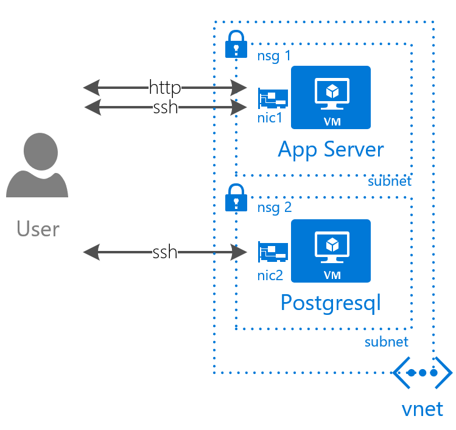
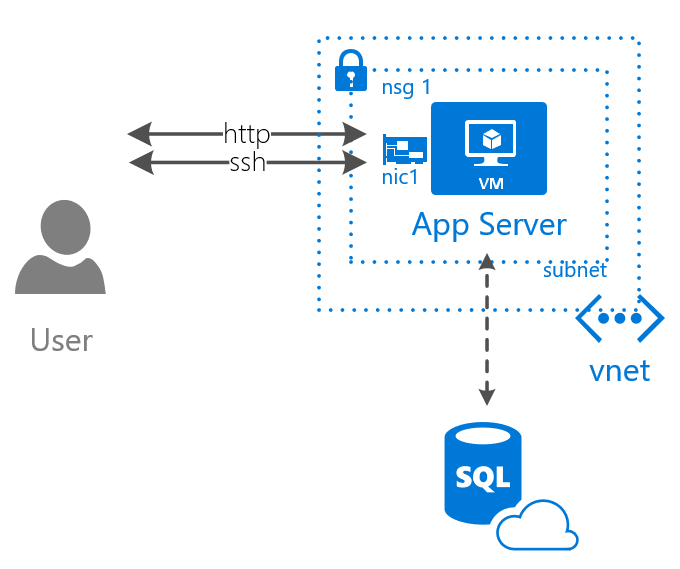

I started hosting my wiki on Azure way back in 2016. The other day I received a message that I was  not using managed disks and I should upgrade. So I pushed the upgrade button and kicked off a two day outage which resulted in me pulling my hair out, migrating, looking at logs, and changing databases.

## First Architecture

The first architecture is really basic. Just two vms. One with confluence installed on it and the other with Postgresql. I configured a separate nsg for each one. Looking back I could have had just one.

- App Server
    - Confluence 5.9.6
    - <CONFLUENCE\_HOME> = /var/atlassian/application-data/confluence/
    - <CONFLUENCE\_INSTALLATION> = /opt/atlassian/confluence/
-  Database
    - Ubuntu 14.04 64-bit
    - PostgreSQL 9.3.12

## Trouble after Reboot

When I rebooted the machine, after a failed managed disk migration, I wasn't able to log in. It took me a while [to figure out what happened](https://community.atlassian.com/t5/Confluence-questions/Failed-to-Login-after-Reboot-Confluence-5-9-6/qaq-p/889565). Turns out I had two instances of confluence running on the app server. This made me think I should do a few things:

- Make a backup
- Clean up the installation

Instead of cleaning up the installation I thought I would try a new architecture

## New Architecture

I replaced the IaaS database for the Azure Database Postgresql PaaS solution. I don't want to mess around with managing a database. One less thing to think about.

- App Server
    - Confluence 5.9.6 (Can't change)
-  Database
    - PostgreSQL 9.5

Confluence does not support Postgres 9.6, and will throw error messages like the following: org.postgresql.util.PSQLException: ERROR: column am.amcanorder does not exist

## Future work

Turns out I had to use the export restore option with Confluence. I though I would be able to setup the new environment and just perform a pg\_dump and pg\_restore. For some reason that didn't work.

## References

- Restore to Azure DB Postgres https://docs.microsoft.com/en-us/azure/postgresql/quickstart-create-server-database-portal
- How to dump and restore https://docs.microsoft.com/en-us/azure/postgresql/howto-migrate-using-dump-and-restore
- Example of Confluence Setup http://comtronic.com.au/how-to-install-confluence-on-centos7-with-postgresql/
- Remove ubuntu services https://help.ubuntu.com/community/UbuntuBootupHowto
